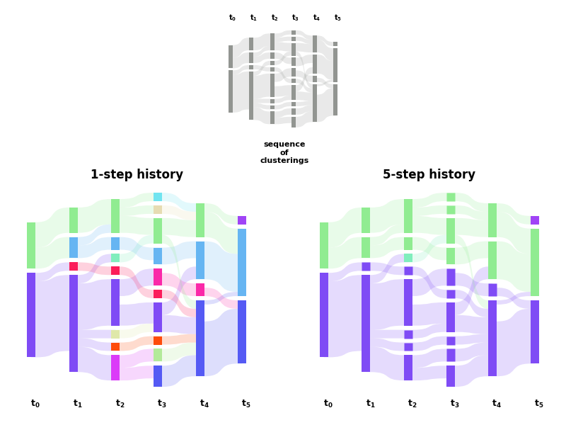

===========
Quickstart
===========

.. include:: ../README.rst
  :start-after: inclusion-p1
  :end-before: exclusion-p1

    
  Effect of the history parameter on a synthetic dynamic community structure.
  Derived from Fig.2 of `<https://arxiv.org/abs/1912.04261>`_.

.. literalinclude:: ../examples/history.py
   :language: python
   :lines: 1-228
   :emphasize-lines: 5, 81-86

The full script can be downloaded :download:`here <../examples/history.py>`.

.. include:: ../README.rst
  :start-after: inclusion-p2
  :end-before: exclusion-p2
